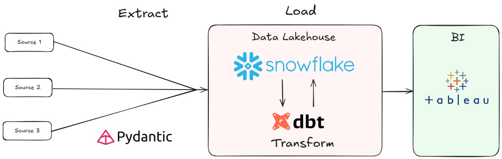

# dbt_triade

This repository will be used to present and track the **Study Plan** and **Study Case** for the data stack used by client x.

Additionally, all hands-on code will be stored in this repository.

## Study Plan

<strong>dbt</strong>

### Goal

- Prepare for **dbt Analytics Engineering Certification,** and and deepen knowledge of dbt concepts and tools.

### Timeline

- Duration: 3 to 4 weeks
- Dedication: 10 to 12 hours per week
- Theoretical study and hands-on projects

### Study Materials

- **Book:** _Analytics Engineering With SQL And DBT_
- **Video Course:** _dbt Course_ <https://learn.getdbt.com>
- **Resources:* _dbt Labs Tests and guides_

### Study Tracking - Analytics Engineering With SQL And DBT

- [x]  <s>Chapter 1: Analytics Engineering</s> 

- [ ]  Chapter 2: Data Modeling for Analytics

- [ ]  Chapter 3: SQL for Analytics

- [ ]  Chapter 4: Data Transformation with dbt

- [ ]  Chapter 5: dbt Advanced Topics

- [ ]  Chapter 6: Building an End-to-End Analytics Engineering Use Case

(link to git repo, if applicable)

<strong>Snowflake</strong>

Ipson Lorem

<strong>Tableau</strong>

Ipson Lorem

## Study Case

Apply all acquired knowledge to a **real-world case study**.

